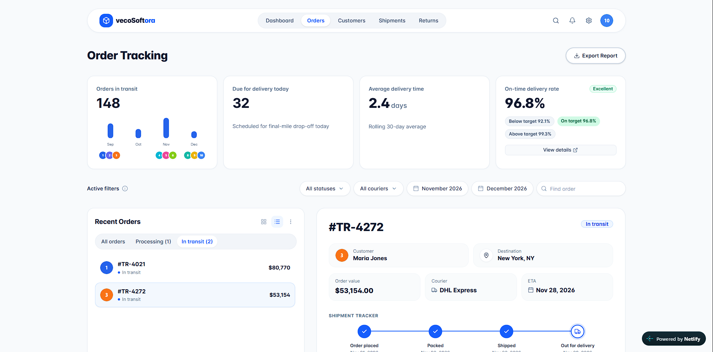

# VecoSoft Order Track

Two complementary demos in one Next.js app:

1. **Consumer Order Tracking** (`/`) — mobile-first shopper tracking with live preview controls
2. **Trackora Admin Dashboard** (`/trackora`) — dark-themed logistics admin panel



## Tech Stack

| Tool                       | Purpose       |
| -------------------------- | ------------- |
| Next.js 16 (App Router)    | Framework     |
| TypeScript                 | Type safety   |
| Tailwind CSS v4            | Styling       |
| shadcn/ui                  | UI components |
| Framer Motion              | Animations    |
| Chart.js + react-chartjs-2 | Charts        |
| lucide-react               | Icons         |

## Getting Started

```bash
npm install
npm run dev
```

| App                       | URL                                                                                          |
| ------------------------- | -------------------------------------------------------------------------------------------- |
| Trackora dashboard (home) | [https://magenta-creponne-06cccb.netlify.app/](https://magenta-creponne-06cccb.netlify.app/) |
| github                    | [https://github.com/sodium000/vecosoft.git](https://github.com/sodium000/vecosoft.git)       |

### Production

```bash
npm run build
npm start
```

Deploy to [netlify](https://magenta-creponne-06cccb.netlify.app/) with no extra configuration.

---

## Consumer Order Tracking (`/`)

- Responsive layout (phone → desktop)
- Scenarios: In Transit, Delayed, Delivered (Not Received), Tracking Unavailable
- Live preview controls update Chart.js visuals instantly
- Loading / error states via `?view=loading` or `?view=error`

Query params: `?scenario=in_transit|delayed|delivered_not_received|tracking_unavailable`

Data: `src/data/orderData.ts`

---

## Trackora Admin Dashboard (`/trackora`)

Dark logistics dashboard with lime accent (`#baff29`), near-black background (`#0a0a0a`), and a contrasting white order detail panel.

### Features

- Floating navbar with animated active pill (Orders)
- Stats row with count-up numbers + Chart.js in-transit sparkline (Sep–Dec)
- Filter pills (status, courier, dates) + search
- **40/60 split**: Recent Orders list + Order Detail panel
- Row selection with Framer Motion highlight; detail panel `AnimatePresence` on order change
- Shipment stepper replays connector animation when selecting another order
- Export report (CSV download)
- **View live tracking** links to consumer app

### State

- `selectedOrderId` in `OrdersDashboard.tsx` (default `#TR-4272`)
- Row clicks update detail via `orders` from `src/data/mockData.ts`
- Filters + list tabs reduce visible rows; selection auto-adjusts if filtered out

### Component structure

```
src/components/trackora/
├── OrdersDashboard.tsx      # Parent state + layout
├── Navbar.tsx
├── PageHeader.tsx
├── StatsCards.tsx
├── OrdersInTransitChart.tsx
├── FiltersBar.tsx
├── OrdersList.tsx
├── OrderDetailPanel.tsx
├── ShipmentTracker.tsx
└── CustomerAvatar.tsx
```

### Mock data

`src/data/mockData.ts` — orders, `summaryStats`, `filterOptions`, `defaultSelectedOrderId`

### Avatars

Mock paths use `/avatars/1.jpg`, etc. Next.js rewrites these to `/api/avatars/[id]` (generated SVG placeholders).

### Responsive breakpoints

- **Desktop (~1440px)**: full two-column layout, centered max-width shell
- **Tablet (~1024px)**: stacked panels, scrollable mobile nav pills
- **Mobile**: single column, horizontal nav scroll

---

## Project layout

```
src/
├── app/
│   ├── page.tsx                 # Consumer tracking
│   ├── trackora/page.tsx        # Trackora dashboard
│   └── api/avatars/[id]/route.ts
├── components/
│   ├── order-tracker/           # Consumer UI
│   └── trackora/                # Admin UI
└── data/
    ├── orderData.ts
    └── mockData.ts
```

## License

MIT

### Design Prompts

See [prompts.md](public/prompts.md) for the original design prompts.
